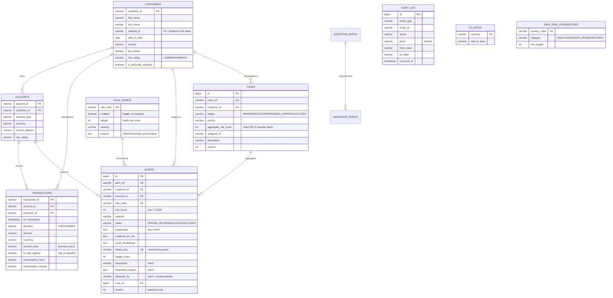

# Sentinel AML — Real-Time Money Laundering Detection Platform

Transaction Monitoring System (TMS) for MeridianTrust Bank. Ingests customer, account and
transaction data, applies configurable AML detection rules, and produces **risk-scored,
explainable alerts** with a full case-management workflow and an immutable audit trail.

Built to the supplied problem statement (`Sentinel_AML__Building_Real-Time_Money_Laundering_Detection_.md`).

### Where to start

| If you want to… | Go to |
|---|---|
| **Just see it** — the analyst console, populated and clickable | **http://localhost:3000** after `docker compose up --build` |
| **Check the deliverables** — every requirement mapped to the file or command that proves it | **[`deliverables/DELIVERABLES.md`](deliverables/DELIVERABLES.md)** |
| **See it work** — the full ingestion → detection → alert → case disposition flow | **[`deliverables/DEMO.md`](deliverables/DEMO.md)** |
| Understand the architecture, set it up, or tune the rules | This README — the three sections below |

---

## Measured results (cold start, local Postgres)

| Metric | Result | Requirement |
|---|---|---|
| 10,000 transactions ingested + detected | **1,581 ms** | < 120,000 ms |
| Alerts generated | 2,533 | — |
| Rejected records | 0 | — |
| Application startup | 2.8 s | — |
| Detection rules active | 6 (all firing) | 5 typologies required |
| Laundering typologies in seed data | 6 | ≥ 3 required |

The bulk figure is printed on every startup by `SeedDataLoader` and returned in the
`durationMs` field of every ingestion response — it is measured, not asserted.

Alert counts vary by a few dozen between runs (a Dockerised run measured 2,587 alerts in
2,313 ms). The generated data is deterministic, but transaction timestamps are anchored to
start time, so the 24-hour and daily window buckets fall differently on each run. Both figures
sit far inside the 2-minute budget.

---

## Setup instructions

### Option A — Docker (recommended; nothing but Docker required)

```bash
cp .env.example .env
docker compose up --build
```

That is the whole setup. The build runs **inside** Docker, so no local JDK, Gradle or Postgres
is needed. Two containers start:

| Container | Port | Role |
|---|---|---|
| **`sentinel-web`** | **`3000`** | **React analyst console — open this** |
| `sentinel-api` | `8080` | Spring Boot application |
| `sentinel-db` | `5433` → 5432 | PostgreSQL 16 (mapped off 5432 to avoid clashing with a local install) |

Open **http://localhost:3000** and sign in as `analyst`, `senior` or `admin`.

The API waits on a genuine Postgres healthcheck rather than merely on the container existing,
then Flyway migrates and the synthetic dataset loads through the real ingestion path. When the
log prints `SENTINEL SEED COMPLETE` the alert queue is already populated — roughly 45 seconds
from a cold `docker compose up --build`.

```bash
docker compose ps          # both services should read "healthy"
docker compose logs -f sentinel-api
docker compose down -v     # stop and discard the database volume
```

### Option B — Local JDK 17 + existing Postgres

```bash
createdb sentinel && psql -d postgres -c "CREATE ROLE sentinel LOGIN PASSWORD 'sentinel_dev_pw'"
./gradlew bootRun --args='--spring.profiles.active=local'
```

| Resource | URL |
|---|---|
| **Analyst console (UI)** | **http://localhost:3000** |
| Swagger UI | http://localhost:8080/swagger-ui.html |
| OpenAPI spec | http://localhost:8080/v3/api-docs |
| Health | http://localhost:8080/actuator/health |

### Demo credentials

| User | Password | Role |
|---|---|---|
| `analyst` | `analyst123` | `ANALYST` — queue (masked PII), cases, dispositions |
| `senior` | `senior123` | `SENIOR_ANALYST` — the above + unmasked PII + SAR escalation |
| `admin` | `admin123` | `COMPLIANCE_ADMIN` — the above + ingestion + rule tuning |

Passwords come from environment variables and are BCrypt-hashed at startup. **No credential is
hardcoded** — see `.env.example`.

---

## Architecture

A **modular monolith** with **hexagonal boundaries** at its edges, organised **package by
feature** rather than by layer, so a change stays local and a module can be extracted later
without redesign.

```
Ingestion Adapters  ──▶ Validation Chain ──▶ FX Normalisation ──▶ Persistence
  CSV │ REST batch        Structural            (business rule 9)       │
  REST stream             Referential                                   ▼
  (Kafka: same port)      Business                          ┌──────────────────────┐
                                                            │   DetectionEngine    │
                                                            │ List<DetectionRule>  │
                                                            │  injected by Spring  │
                                                            └──────────┬───────────┘
                                                                       ▼
                                              RiskScoring ──▶ Dedup upsert ──▶ Alert
                                                                       ▼
                                                        Case workflow + immutable audit
```

### The central design decision

`DetectionEngine` depends on the `DetectionRule` **interface** and never on a concrete rule.
Spring injects every implementation on the classpath.

**Adding a seventh laundering typology costs one class and one `rule_config` row. No existing
file is edited.** That is the Open/Closed Principle doing real work, and it is what makes the
system adaptable to the extensions in the problem statement without rework.

Rules are **pure functions** — no I/O, no persistence, no mutable state. Everything arrives in
an immutable `RuleContext`; everything produced is a `RuleHit`. Three consequences:

- **Testable** without Spring, a database, or heavy mocking — the whole rule suite runs in milliseconds.
- **Thread-safe** with no locking anywhere, because there is no shared mutable state to protect.
- **Fast**, because windows are pre-loaded per chunk rather than queried per transaction.

### Package layout

```
com.meridiantrust.sentinel
├── common/          shared kernel — Money, audit, errors, security, config
├── customer/ account/ transaction/    master data and the transaction ledger
├── reference/       FX rates, jurisdictions, watchlist, RULE CONFIGURATION
├── ingestion/       ports, adapters, validation chain, batch reporting
├── detection/       DetectionEngine, DetectionRule, RuleContext, rules/
├── alerting/        scoring, deduplication, alert lifecycle
└── casemanagement/  investigation workflow and state machine
```

### Design patterns applied

| Pattern | Where | Why it earns its place |
|---|---|---|
| **Strategy** | `DetectionRule` implementations | New typology = new class, zero edits elsewhere |
| **Template Method** | `AbstractDetectionRule` | Config, dedup keys and explanations handled once |
| **Chain of Responsibility** | Ingestion validators | Independently testable, ordered by cost |
| **Ports & Adapters** | `TransactionIngestPort` | CSV / REST / Kafka behind one contract |
| **Value Object** | `Money` | Currency mismatches become compile-time and runtime errors |
| **Factory** | `AlertPersister` | One construction path, so invariants cannot be bypassed |
| **State** | `AlertStatus`, `CaseStatus` | Illegal transitions impossible, centrally enforced |
| **Cache-aside** | `RuleConfigProvider` | Runtime tunability without a query per evaluation |
| **Observer-ready** | Ingestion → detection seam | Async / Kafka extraction without redesign |

---

## Business rules — where each one lives

| # | Rule | Implementation | Verify it |
|---|---|---|---|
| 1 | Single txn ≥ threshold | `CtrThresholdRule` | `GET /api/v1/alerts?ruleCode=CTR_THRESHOLD` |
| 2 | 3+ txns of 9,000–9,999 in 24h | `StructuringRule` | `?ruleCode=STRUCTURING` |
| 3 | ≥80% of a deposit out in 48h | `RapidMovementRule` | `?ruleCode=RAPID_MOVEMENT` |
| 4 | Listed jurisdiction/counterparty, **any amount** | `HighRiskJurisdictionRule` | `?ruleCode=HIGH_RISK_JURISDICTION` |
| 5 | Daily value > 3× 90-day average | `BehavioralDeviationRule` | `?ruleCode=BEHAVIORAL_DEVIATION` |
| 6 | Alerts never deleted | No delete path exists in `AlertRepository` | `?status=CLOSED` returns disposition + analyst |
| 7 | Weighted 0–100 score, sortable | `RiskScoringService` | `?sortBy=riskScore&direction=desc` |
| 8 | PII masked in lists, full in detail for authorised roles | `PiiMasker` + two DTO projections | `/customers/{id}` vs `/customers/{id}/full` |
| 9 | Amounts normalised to base currency | `Money` + `FxConversionService` | Every txn carries `amountBase` + `fxRateApplied` |

Plus a sixth typology beyond the mandate: **repeated round-number amounts**
(`RoundAmountPatternRule`).

---

## Rule configuration approach

Detection thresholds are tunable at runtime, without a redeployment. They are deliberately
**not** in `application.properties`, because that file is baked into the image. They live in the
`rule_config` table and are changed through the admin API:

```bash
# Loosen structuring to catch pairs rather than triples — takes effect immediately
curl -u admin:admin123 -X PATCH http://localhost:8080/api/v1/admin/rules/STRUCTURING \
  -H 'Content-Type: application/json' \
  -d '{"params":{"minCount":2,"windowHours":24,"lowerBound":9000,"upperBound":9999.99}}'
```

Three things happen on every write:

1. **Validation** — a configuration that could never fire (inverted band, zero window, ratio
   above 1.0) is rejected. A typo that silently disabled a control would be worse than an error.
2. **Cache invalidation** — the change applies on the next evaluation. No restart.
3. **Audit** — who changed a detection threshold, when, and what it was before.

Rules can also be toggled (`{"enabled": false}`) and reweighted (`{"weight": 40}`).
FX rates, jurisdictions and the counterparty watchlist are tunable the same way.

---

## How correctness is protected

### Deduplication and concurrency — one mechanism, two requirements

Each rule emits a deterministic `dedupKey` identifying the *underlying pattern*, not the
triggering row. The column carries a `UNIQUE` constraint, and the write path is
**check → insert → catch violation → merge**, with each attempt in its own transaction.

- A **`SELECT`-then-`INSERT` guard would race** under concurrent streams. The database
  constraint makes it the single arbiter.
- Per-transaction isolation matters because a constraint violation poisons a JPA transaction.
  Isolating the insert lets the loser merge cleanly instead of failing the whole batch.

This satisfies alert de-duplication *and* the "no duplicate or lost alerts" concurrency NFR
with one mechanism and **no application-level locking**.

### Risk scoring uses noisy-OR, not summation

```
aggregate = 100 × (1 − Π(1 − scoreᵢ/100))
```

Summing saturates instantly — three medium alerts would exceed 100 and clamp, making a
moderate case indistinguishable from a severe one. The top of the queue would become a wall of
100s and the ordering business rule 7 exists to provide would be destroyed. Noisy-OR is
bounded, monotonic, and has a defensible probabilistic reading.

### False-positive guards

The rules that would otherwise flood the queue carry explicit floors:

- `BEHAVIORAL_DEVIATION` requires a minimum baseline — otherwise every new customer's *third*
  transaction is a "3× deviation".
- `RAPID_MOVEMENT` requires a minimum deposit — otherwise ordinary salary-and-spend is layering.
- `ROUND_AMOUNT_PATTERN` is weighted lowest; it is corroborating evidence, not a standalone case.

### Fault isolation

Each rule is evaluated inside a try/catch. A defect in the round-number rule must never stop
the structuring rule from catching an actual launderer.

---

## Testing

```bash
./gradlew test
```

Detection rules are tested at their **boundaries**, because the boundary *is* the rule:

| Rule | Boundary cases covered |
|---|---|
| `CTR_THRESHOLD` | 9,999.99 no · **10,000.00 yes** · 10,000.01 yes · configurable threshold |
| `STRUCTURING` | 2 no · **3 yes** · 25h span no · band inclusive at 9,000.00 and 9,999.99 · non-overlapping clusters |
| `RAPID_MOVEMENT` | 79% no · **80% yes** · 49h no · below deposit floor no · outflow before deposit no |
| `BEHAVIORAL_DEVIATION` | below multiplier no · **above yes** · cold start no · below value floor no |
| `HIGH_RISK_JURISDICTION` | **₹1 to a sanctioned country → alert** (amount-independent) · higher weight wins · null country safe |
| `ROUND_AMOUNT_PATTERN` | 3 round yes · mixed no · below floor no |
| `RiskScoringService` | clamping · log-scaled magnitude · recurrence cap · noisy-OR monotonicity |
| `PiiMasker` | names, IDs, emails, phones, and null/short edge cases |

---

## Analyst console (React)

A deliberately small single-page app — React 18 + Vite, hand-rolled CSS, no component or
charting library — covering exactly the four views the brief asks for:

| View | What it shows |
|---|---|
| **Alert queue** | Sorted by risk score descending, PII masked. Filter by status, severity, rule. Selecting an alert opens a panel with the generated explanation, the risk-score breakdown, and the evidence transactions — and the actions to dispose it or open a case. |
| **Risk heatmap** | Customer × typology grid, cell intensity = peak risk score. |
| **Customer transaction timeline** | Chronological activity with alert-evidence transactions flagged, so suspicious movement is visible in the context around it. |
| **Case detail** | Member alerts, narrative, disposition controls, the immutable audit trail, and one-click **SAR draft** generation — all on the same screen as the decision. |

The heatmap uses a **single-hue sequential ramp** (light → dark) rather than a rainbow: for a
magnitude encoding, visual order then matches numeric order, which a multi-hue scale cannot
guarantee. Every cell also prints its score, and every severity badge carries a text label, so
no value depends on colour alone.

`nginx` proxies `/api` to the API container, so the browser sees one origin and there is no
CORS configuration to get wrong. Credentials are held in memory for the session only —
a compliance console should not leave them in `localStorage`.

Run it standalone against a local API with `cd frontend && npm install && npm run dev`
(port 5173, Vite proxies `/api` to `localhost:8080`).

## SAR draft generation

`GET /api/v1/cases/{caseRef}/sar-draft` (JSON) or `/sar-draft/text` (printable) assembles a
filing-ready **draft Suspicious Activity Report** from a case: subject details, accounts
involved, the transaction schedule, and a narrative composed from each alert's own explanation —
so every sentence traces back to the detection that produced it.

This is one of the problem statement's **extension ideas**, delivered. The other five are listed
with their status in [`deliverables/DELIVERABLES.md` §G](deliverables/DELIVERABLES.md#g-extension-ideas--status-of-all-six).

Restricted to `SENIOR_ANALYST`, because a SAR necessarily carries *unmasked* subject PII — one
that masks its subject identifies nobody and is of no use to a Financial Intelligence Unit.
Generating a draft is itself written to the audit trail.

The draft never overstates suspicion: the recommended action follows the case's real disposition,
so a case closed as `FALSE_POSITIVE` yields a draft that says plainly *"this draft should NOT be
filed."*

## API

All endpoints are versioned under `/api/v1`, documented in Swagger, and return RFC 7807
`ProblemDetail` on failure with a `traceId` that matches the server logs.

| Method | Path | Role |
|---|---|---|
| `POST` | `/ingestion/customers/csv`, `/accounts/csv`, `/transactions/csv` | ADMIN |
| `POST` | `/ingestion/transactions` | ADMIN — **streaming, returns alerts inline** |
| `GET` | `/ingestion/batches/{ref}` | ANALYST — accepted/rejected counts + every rejection reason |
| `GET` | `/alerts` | ANALYST — queue, masked PII, sortable by risk score |
| `GET` | `/alerts/{ref}` | ANALYST — explanation, evidence, score breakdown |
| `PATCH` | `/alerts/{ref}/status` | ANALYST — transition / dispose |
| `POST` `GET` `PATCH` | `/cases` … | ANALYST — open, queue, transition, assign |
| `GET` | `/customers/{id}` | ANALYST — **masked** |
| `GET` | `/customers/{id}/full` | **SENIOR** — unmasked |
| `GET` | `/customers/{id}/timeline` | ANALYST |
| `GET` | `/cases/{ref}/sar-draft` | **SENIOR** — generated SAR draft (JSON, or `/text`) |
| `GET` | `/audit` | ANALYST — immutable trail |
| `GET` `PATCH` | `/admin/rules[/{code}]` | ADMIN — runtime tuning |
| `GET` `PUT` | `/admin/fx-rates` | ADMIN |
| `GET` `POST` `DELETE` | `/admin/jurisdictions`, `/admin/watchlist` | ADMIN |
| `GET` | `/dashboard/stats`, `/dashboard/heatmap` | ANALYST |

**Status codes:** `200` read · `201` create · `400` validation · `401` unauthenticated ·
`403` role denied · `404` unknown · `409` optimistic-lock conflict · `422` illegal transition.

---

## Demo walkthrough

> Full scripted walkthrough with real output: **[`deliverables/DEMO.md`](deliverables/DEMO.md)**.
> The condensed version:

```bash
# 1. The queue — highest risk first, PII masked
curl -u analyst:analyst123 \
  'http://localhost:8080/api/v1/alerts?size=5&sortBy=riskScore&direction=desc'

# 2. Alert detail — WHY it fired, with evidence and score breakdown
curl -u analyst:analyst123 http://localhost:8080/api/v1/alerts/{alertRef}

# 3. RBAC is real, not cosmetic
curl -u analyst:analyst123 http://localhost:8080/api/v1/admin/rules            # 403
curl -u analyst:analyst123 http://localhost:8080/api/v1/customers/CUST_00134/full  # 403
curl -u senior:senior123  http://localhost:8080/api/v1/customers/CUST_00134/full   # 200

# 4. Streaming detection — alerts returned in the same response
curl -u admin:admin123 -X POST http://localhost:8080/api/v1/ingestion/transactions \
  -H 'Content-Type: application/json' \
  -d '{"transactionId":"TXN_DEMO_1","accountId":"ACC_000204","txnTimestamp":"2026-09-19T10:00:00",
       "direction":"DEBIT","amount":950.00,"currency":"INR",
       "counterpartyName":"Delta Bridge Exchange","counterpartyCountry":"IR"}'

# 5. Open a case, then dispose it — reason and identity retained forever
curl -u analyst:analyst123 -X POST http://localhost:8080/api/v1/cases \
  -H 'Content-Type: application/json' \
  -d '{"customerId":"CUST_00134","title":"Sanctioned counterparty exposure",
       "alertRefs":["<alertRef>"],"narrative":"Transfers to a designated entity."}'

curl -u senior:senior123 -X PATCH http://localhost:8080/api/v1/cases/{caseRef}/status \
  -H 'Content-Type: application/json' \
  -d '{"targetStatus":"CLOSED","disposition":"ESCALATED_TO_SAR","reason":"Filed with FIU."}'

# 6. The immutable audit trail of everything above
curl -u analyst:analyst123 'http://localhost:8080/api/v1/audit?entityType=CASE'
```

**The standout demo moment:** the highest-scoring alert in the seed data is an **₹850**
transfer to a sanctioned entity. It proves business rule 4 applies no amount threshold — a
small "test" transfer is exactly how an operator verifies a channel before moving real money.

---

## Seed data

500 customers, 737 accounts, 10,000 transactions — fully synthetic, deterministic seed, **no
real PII**. Exported as data files in **[`deliverables/seed-data/`](deliverables/seed-data/)**
(`customers.csv`, `accounts.csv`, `transactions.csv`) and regenerated automatically on a cold
start by [`SeedDataLoader`](src/main/java/com/meridiantrust/sentinel/seed/SeedDataLoader.java). Six laundering typologies are deliberately planted, one per rule, so every rule has
an inspectable demonstration case:

| Typology | Planted as |
|---|---|
| Structuring | 5 deposits of ₹9,200–9,850 across 18 hours |
| Layering | ₹850,000 in, 92% dispersed to 4 offshore counterparties within 31h |
| Jurisdiction risk | Transfers to a sanctioned entity — including the ₹850 test transfer |
| Behavioural deviation | 90 days at ~₹15k/day, then a ₹620k day |
| Round amounts | 6 exact multiples of ₹50,000 in one day |
| CTR via FX | A **USD** transfer that only breaches the threshold *after* normalisation |

The remaining ~95% is benign background traffic. A seed file where everything alerts would
prove the rules fire but nothing about whether they discriminate — and false-positive rate is
what decides whether an AML system is usable.

---

## Database schema & ERD

PostgreSQL 16. The schema is owned by **Flyway** (`src/main/resources/db/migration/`), and
Hibernate runs with `ddl-auto=validate` so it can verify the entity mapping but never alter the
schema. Migrations apply automatically on startup.

| Script | Contents |
|---|---|
| [`V1__core_schema.sql`](src/main/resources/db/migration/V1__core_schema.sql) | All tables, foreign keys, indexes, constraints |
| [`V2__reference_data.sql`](src/main/resources/db/migration/V2__reference_data.sql) | FX rates, jurisdictions, watchlist, the six rule configurations |

### Entity relationship diagram



**Three modelling decisions worth defending:**

- **`customer_id` is denormalised onto `transactions`.** Strictly derivable via `account_id`, but
  business rule 5 and the alert queue are customer-scoped, so carrying it removes a join from the
  hottest detection path. Deliberate, and the foreign key still enforces integrity.
- **Reference data lives in tables, not enums.** Sanctions lists change by regulatory
  announcement, sometimes overnight. Compiling one into a build artifact would mean a
  redeployment to respond to a designation.
- **`@Version` on `alerts` and `cases`.** Two analysts acting on one alert must not silently
  overwrite each other; the conflict surfaces as `409`, never last-writer-wins.

**Indexes** follow the detection access paths: `(account_id, txn_timestamp)` and
`(customer_id, txn_timestamp)` carry every window rule, and `risk_score DESC` backs the queue sort.
